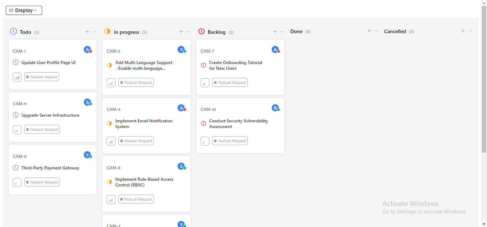
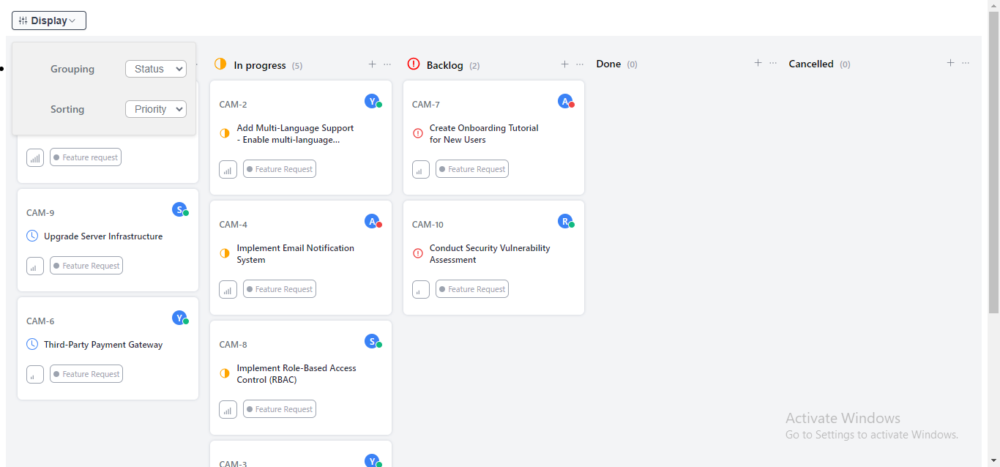
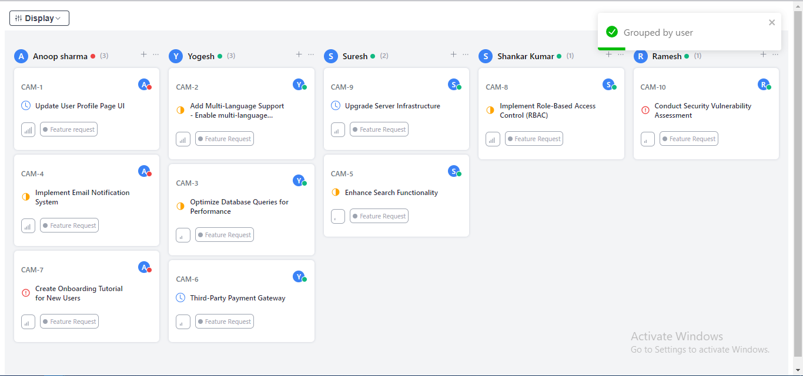
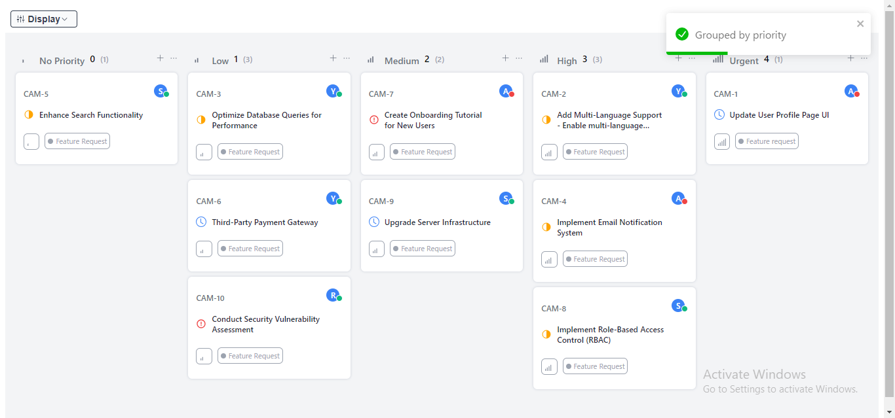
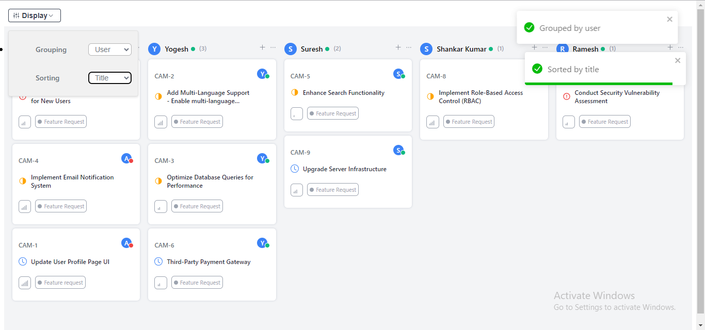
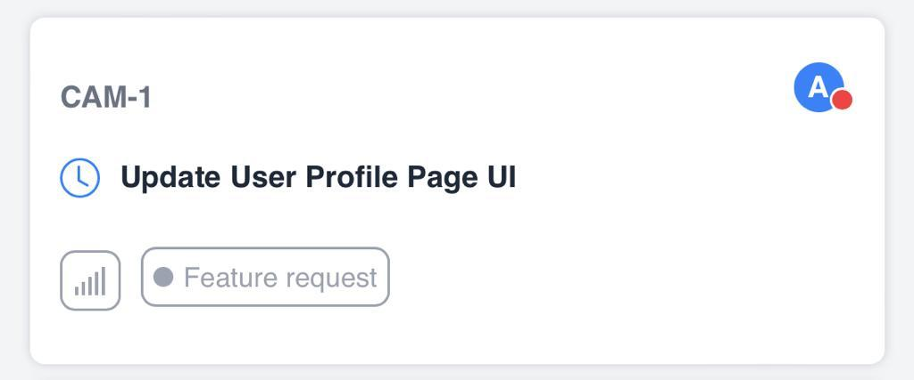

## Kanban Board
This is a Kanban ticket management web-application built with `ReactJS`. It allows users to organize and track tasks using a Kanban board interface.

The web-app fetches ticket data from an **API** and displays each ticket's `ID`, `user availability status`, `priority`, `status`, `title`, and `tag` of a particular **ticket**. 

The user can **customize** the display by **grouping** and **sorting** tickets based on different criteria. Let's have a look at various states (or criterias)

#### 1.Default: `Grouping=status` && `Sorting=priority`

#### 2.When Display is clicked

#### 3.Display State: `Grouping=User` && `Sorting=Priority`

#### 4.Display State: `Grouping=Priority` && `Sorting=Priority`

#### 4.Display State: `Grouping=User` && `Sorting=Title`

#### Card

**Developed and Designed by**  [Aayush Talreja](https://bio.link/aayushtalreja)
 

**Project Link**

 

**GitHub Link**

 

**Contact**

 
